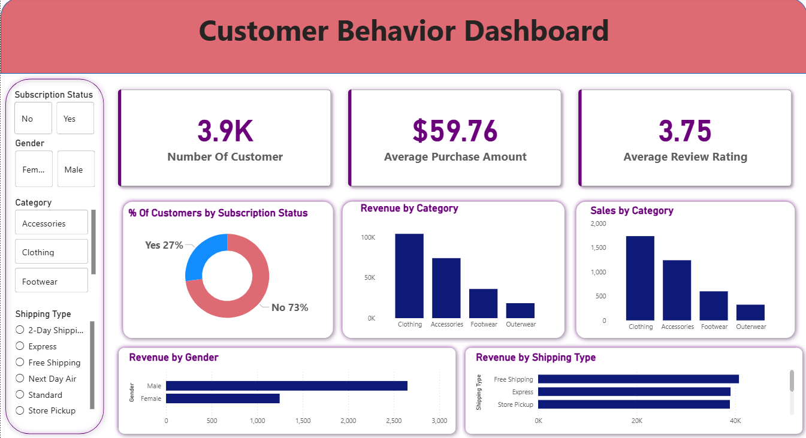
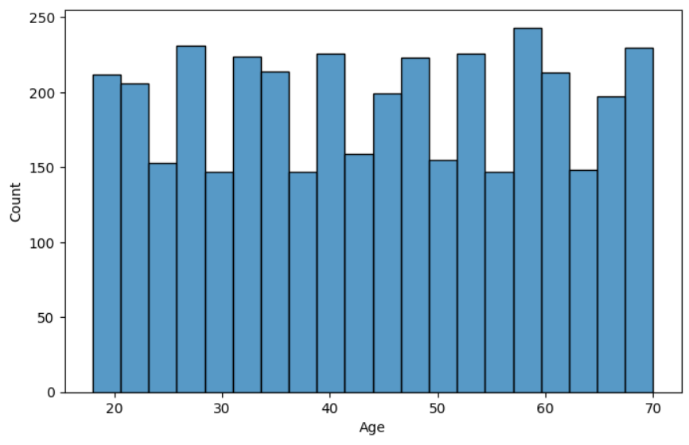
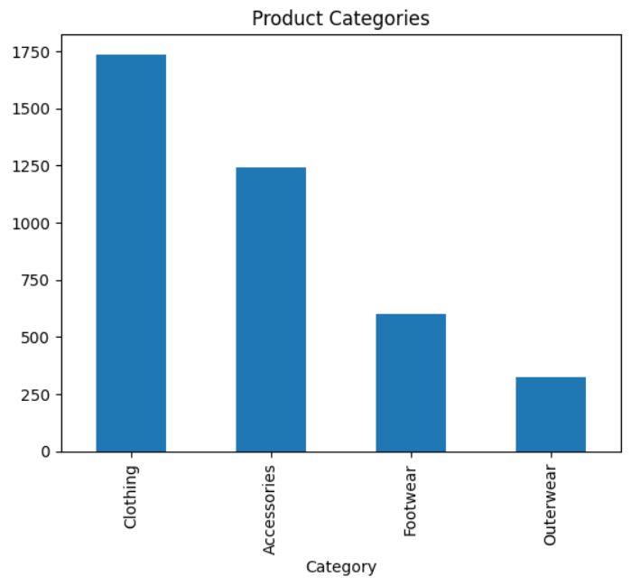
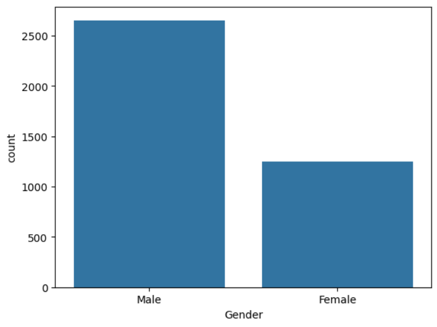
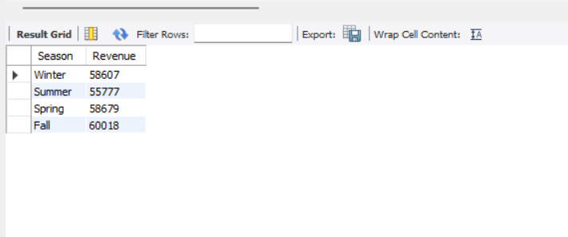

# Customer Shopping Behavior Analysis

## 📌 Project Overview

This project analyzes customer shopping behavior using Python, SQL, and Power BI. The objective is to identify purchasing patterns, customer preferences, product performance, and sales trends to generate actionable business insights.

---

## 👨‍💻 Developed By

**Aaditya Pandhare**

Aspiring Data Engineer | Python | SQL | Power BI

---

## 🎯 Project Objectives

- Analyze customer purchasing behavior
- Identify top-performing product categories
- Evaluate customer spending patterns
- Analyze seasonal sales trends
- Understand payment method preferences
- Create an interactive business dashboard

---

## 🛠️ Tools & Technologies Used

- Python
- Pandas
- NumPy
- Matplotlib
- Seaborn
- MySQL
- Power BI
- VS Code

---

## 📊 Project Workflow

### 1. Data Collection
- Imported Customer Shopping Trends dataset

### 2. Data Cleaning
- Checked missing values
- Removed duplicates
- Verified data types

### 3. Exploratory Data Analysis (Python)
- Customer demographic analysis
- Category-wise sales analysis
- Spending pattern analysis
- Seasonal trend analysis

### 4. SQL Analysis
Performed business-focused SQL queries:

- Total Customers
- Total Sales
- Average Spending
- Category-wise Revenue
- Gender-wise Spending
- Season-wise Revenue
- Payment Method Analysis
- Top Purchased Products
- Location-wise Revenue

### 5. Power BI Dashboard
Created an interactive dashboard featuring:

- Total Customers KPI
- Total Sales KPI
- Average Spending KPI
- Category-wise Revenue
- Gender Analysis
- Season-wise Sales
- Payment Method Distribution
- Top Purchased Products

---

## 📈 Key Insights

- Clothing category generated the highest revenue.
- Customer purchasing behavior varies across product categories.
- Seasonal trends influence overall sales performance.
- Payment method preferences show clear customer patterns.
- Certain locations contribute significantly to total revenue.

---

## 📂 Project Files

```text
Customer Shopping Behavior Analysis
│
├── archive/
│   └── shopping_trends.csv
│
├── cleaned_shopping_data.csv
├── customer_analysis.ipynb
├── customer_shopping_queries.sql
├── README.md
│
├── powerbi/
│   └── Customer_Shopping_Dashboard.pbix
│
└── screenshots/
    └── dashboard.png
```

---

# Customer Shopping Behavior Analysis

## 📊 Dashboard Preview



## 🐍 Python Analysis

### Age Distribution



### Category Analysis



### Gender Analysis



## 🗄️ SQL Analysis

### Season Wise Revenue



---

---

## 🚀 Skills Demonstrated

- Data Cleaning
- Exploratory Data Analysis (EDA)
- SQL Querying
- Data Visualization
- Business Intelligence
- Dashboard Development
- Problem Solving

---

## 🔗 Connect With Me

LinkedIn: https://www.linkedin.com/in/aaditya-pandhare-0b26b32a7/

GitHub: https://github.com/Aaditya0615

---
